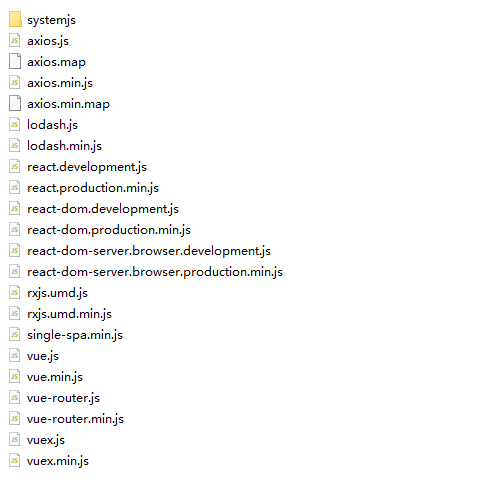

## 公共依赖抽离

### common-deps-static
***
公共依赖文件全部放在`核心服务/common-deps-static`文件夹中，里面包含了开发react、vue项目所需要的基本js依赖，用户可以根据自身需要进行增删。
  
通过`systemJS`将这些js依赖引入进项目中，并赋予别名，这样在子模块中，通过import同样可以正常引入，子模块则不需要打包这些公共依赖了，大大地缩小了项目打包后的体积。

### 自定义公共依赖
***
要想自定义公共依赖，只需要修改配置文件:`核心服务/mess.config.js`

```js
module.exports = {
    ...
    "common-deps": {
        "development": {
            "react": "/react.development.js",
            "react-dom": "/react-dom.development.js",
            "react-dom/server": "/react-dom-server.browser.development.js",
            "single-spa": "/single-spa.min.js",
            "lodash": "/lodash.js",
            "rxjs": "/rxjs.umd.js",
            "vue": "/vue.js",
            "vuex": "/vuex.js",
            "vue-router": "/vue-router.js",
            "axios": "/axios.js"
        },
        "production": {
            "react": "/react.production.min.js",
            "react-dom": "/react-dom.production.min.js",
            "react-dom/server": "/react-dom-server.browser.production.min.js",
            "single-spa": "/single-spa.min.js",
            "lodash": "/lodash.min.js",
            "rxjs": "/rxjs.umd.min.js",
            "vue": "/vue.min.js",
            "vuex": "/vuex.min.js",
            "vue-router": "/vue-router.min.js",
            "axios": "/axios.min.js"
        }
    },
    ...
}
```  
在`common-deps`中定义`development`和`production`模式下，各自的依赖文件，通常production模式下，采用压缩过后的文件(类似：xxx.min.js)  

`config.js`修改完毕后，你还需要将相关js文件拷贝到`核心服务/common-deps-static`目录下