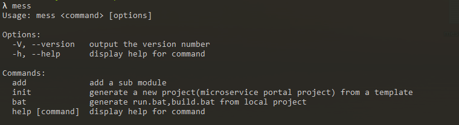

## 安装
推荐使用npm进行依赖安装
```bash
$ npm install mess-cli -g
```

安装之后，你就可以在命令行中使用```mess```命令，你可以运行```mess```命令查看它所支持的命令，并且检测是否安装成功。  
  
  
mess-cli 提供了以下命令
* mess init  -- 初始化一个核心服务(<a href='/#/portal'>传送门</a>)
* mess add -- 初始化一个基于react或者vue的子模块模板(<a href='/#/subModule'>传送门</a>)