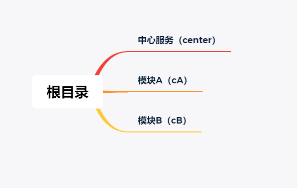
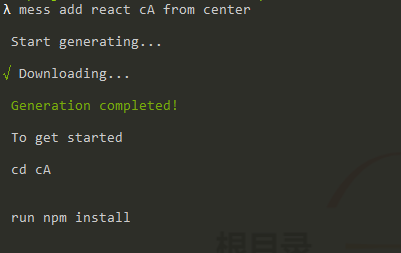
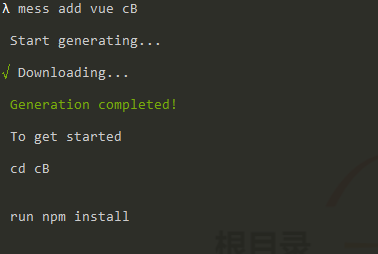

## 添加一个子模块

### mess add
***
`mess add`可以通过预设的模板生成对应的项目，目前支持`react`，`vue`的模板  

`mess add [vue|react] projectName [from portalName]`  
  
projectName是创建的子模块名称，portalName是核心服务的名称  

***
>提示： 在添加完子模块后，请确保它已经注册进了核心服务    

  

`mess add react cA from center`,这条命令将在根目录创建一个名为`cA`的子模块，自动把它注册到同根目录的核心服务`center`,并且自动分配端口。
  
`mess add vue cB`,这条命令将在根目录创建一个名为`cB`的子模块，但`cB`模块没有被注册到任何一个核心服务中([手动注册](/#/registerSubModule))

<blockquote class='tip'>
    
当你的子模块与核心服务在同一个根目录时，建议使用带有from portalName的命令进行创建，因为它将自动为你注册该子模块到核心服务中，并自动分配端口

</blockquote>